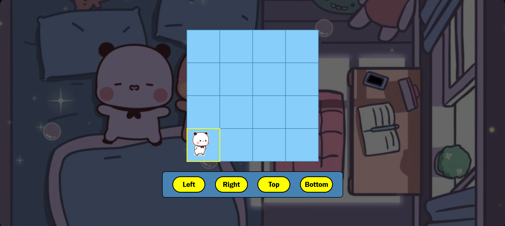
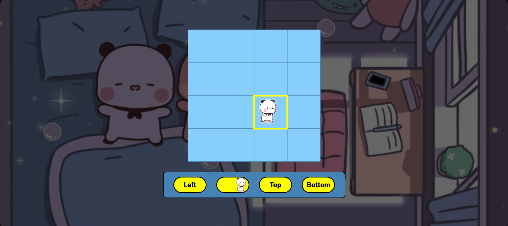
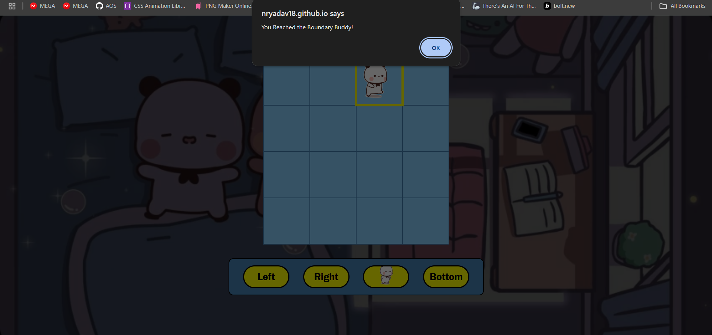

<h1 align="center" style="font-size:40px;">The BUBU Game</h1>
<h3 align="center">Just a Fun Game for a Stress Relief</h3>

---

## 🎬 Website Demo





---

## 📂 Folder Structure

mode-switching-button:
1. index.html # 📱 HTML file
2. assets # 🧠 Image, JSON, Video Assets
3. mst.css # 🧪 Stylings of Website
3. mst.js # 🧪 Functionality of Website

---

## 🧰 Tech Stack

### 💻 Frontend
- HTML5
- CSS3
- JavaScript (JS)

---

### Clone the repo
```bash
git clone https://github.com/nryadav18/thebubugame.git
```

```bash
cd thebubugame
```

### Running the Frontend
```bash
Open using LIVE SERVER
```

